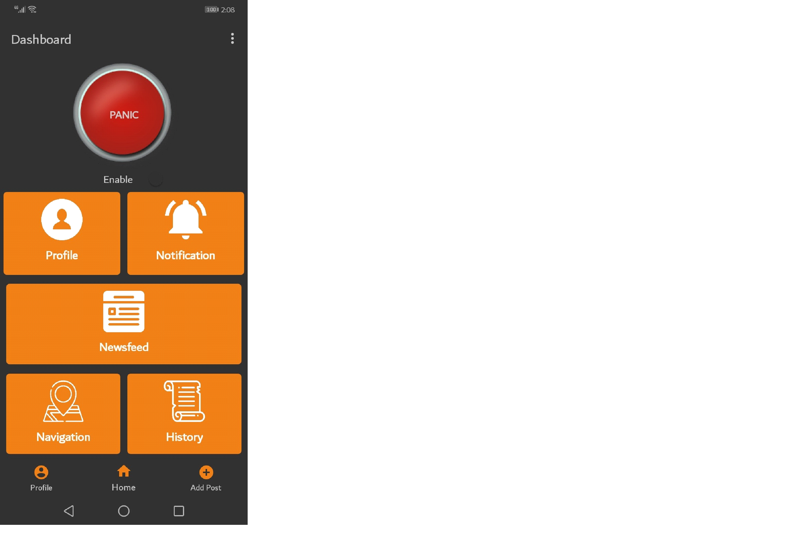
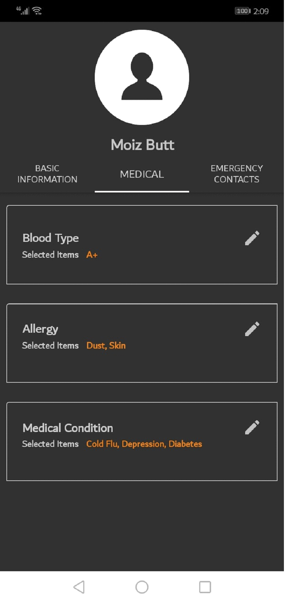
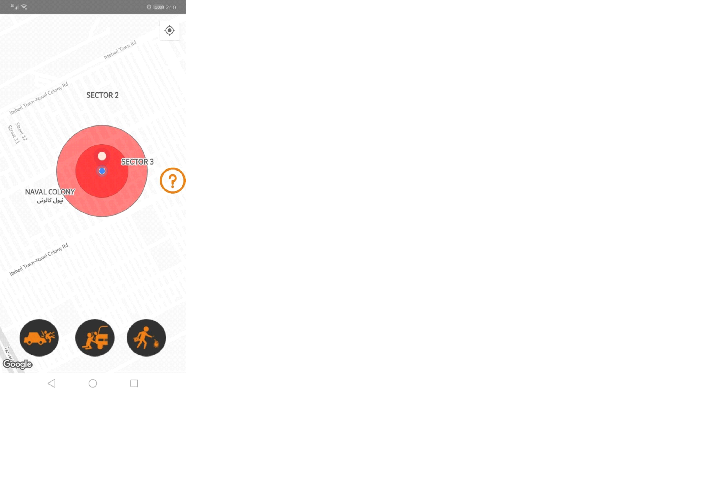
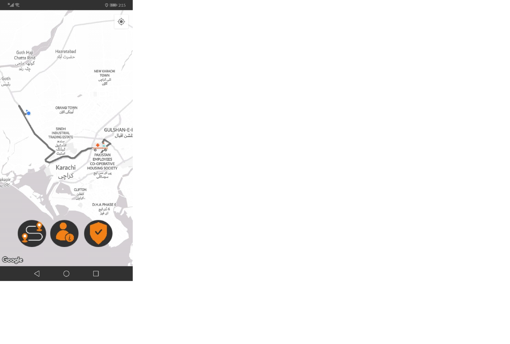
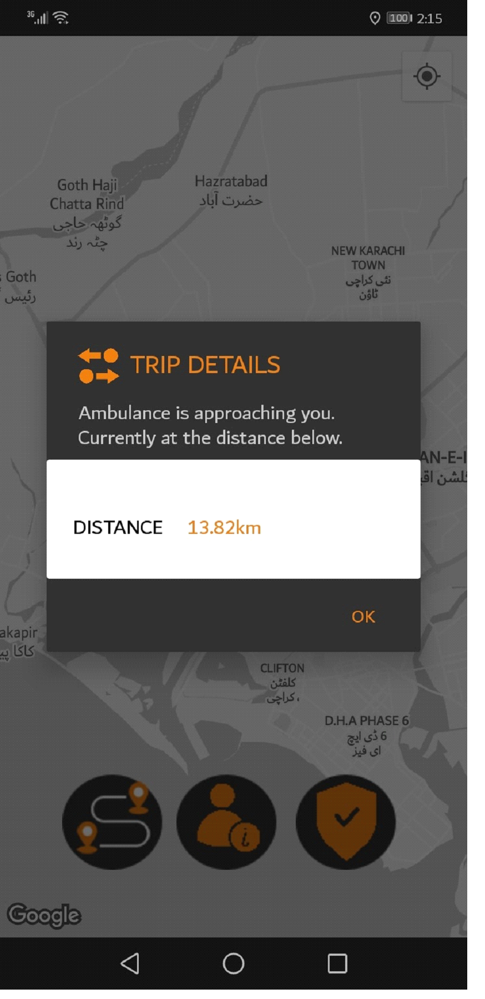
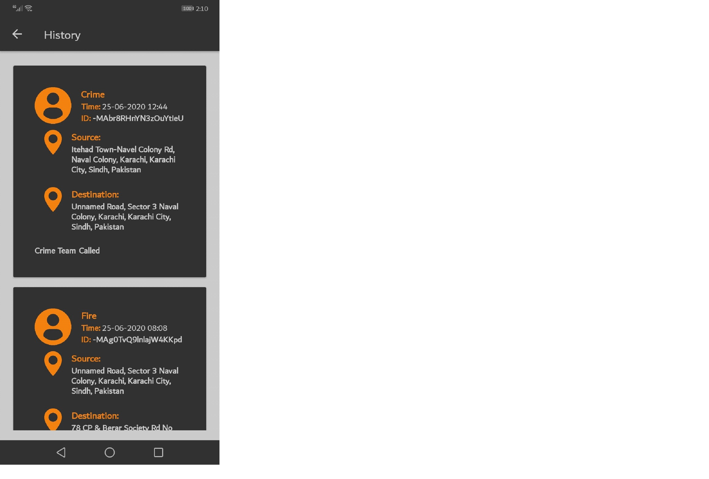
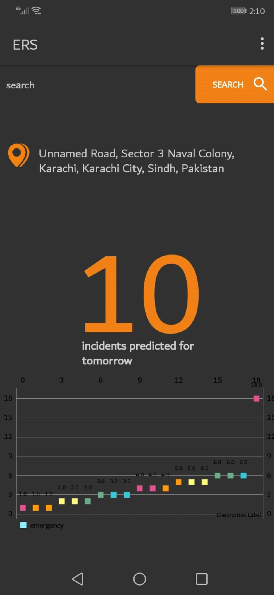
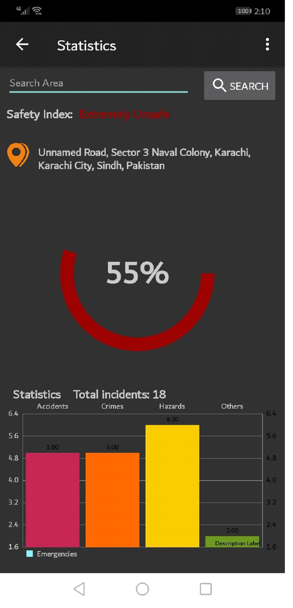
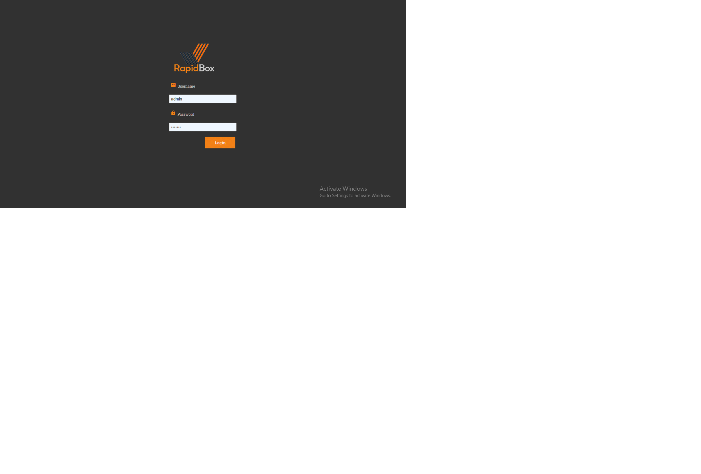
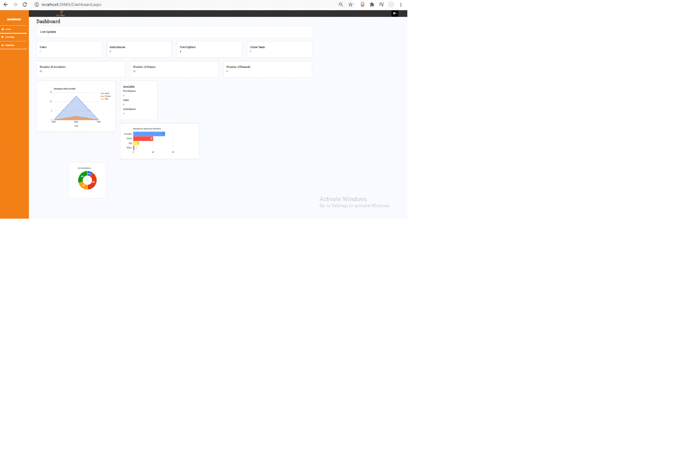

# EMERGENCY-RESPONSE-SYSTEM

Demonstration https://www.youtube.com/watch?v=DSJWea4TKfI&feature=youtu.be

Request an emergency dispatch(ambulance,police or fire) with just one touch,your current location and information(emergency contacts,blood type etc) 
is transfered to the nearest available dispatcher,users can then monitor dispatchers location on a live map.Users can also report incidents like accidents or crimes with the incident reporting function,users can save their important routes so that when an incident occurs near their routes they are promtly alerted.
Users can also view safety levels as well as future predicted incidents for an area based on the historical data of an area using techniques of AI 

Screens

